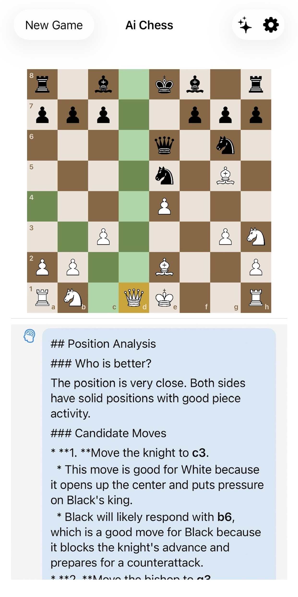

# Chesswise

Chesswise is a SwiftUI iOS chess app with a Stockfish-powered opponent and an on-demand AI chess mentor.

The app is intentionally built as a chess UI: ChessKit maintains board state and legal moves, Stockfish provides engine moves, and Apple Foundation Models provides short coaching explanations when the player asks for help.

<p align="center">
  
</p>

## Features

- Play as White or Black
- Adjustable engine strength
- Stockfish-powered opponent
- ChessKit-backed board state, legal move validation, promotion, check, checkmate, stalemate, and FEN handling
- Board coordinates with file/rank labels
- Legal move highlighting
- Saved game restoration
- On-demand AI mentor guidance
- Markdown-style mentor responses with preserved line breaks
- In-chat waiting indicator while mentor responses are generated

## Architecture

### ChessKit

[ChessKit](https://github.com/chesskit-app/chesskit-swift) is the source of truth for chess rules and board state. The app uses it for:

- Legal move validation
- Board mutation
- Promotion handling
- Game result detection
- FEN generation and restoration

Local app types are mapped to ChessKit types through a dedicated adapter file:

```text
ChessApp/Engine/GameState/ChessKit+AppMapping.swift
```

### Stockfish

Stockfish is used as the engine opponent. The Swift app communicates with Stockfish through a small C/C++ wrapper and UCI commands.

Stockfish is included as a git submodule at:

```text
Stockfish/
```

Current pinned commit:

```text
313ea4ab0410 - Update main network to nn-71d6d32cb962.nnue
```

The concrete engine wrapper is:

```text
ChessApp/Engine/StockfishEngine.swift
```

The Xcode project references Stockfish source files under:

```text
Stockfish/src
```

### AI Mentor

The mentor is on-demand. Tapping the mentor button sends:

- Current FEN
- Full move history
- Side to move
- Player color
- Current Stockfish best move, if available

Responses are requested under an 800-token budget and rendered with Markdown-style formatting in the chat.

If `Apple Foundation Models` is unavailable on a device, the chess game still works and the app shows a mentor-unavailable message.

## NNUE Files Setup

The Stockfish NNUE file is downloaded separately because network files are large and change with Stockfish versions. The currently pinned Stockfish commit expects:

- https://github.com/official-stockfish/networks/blob/master/nn-71d6d32cb962.nnue

After downloading, place the file in the `ChessApp` folder, in the same directory as `stockfish_wrapper.h`.

When updating the Stockfish submodule, check `Stockfish/src/evaluate.h` for the expected `EvalFileDefaultName` and update:

- `ChessApp/Engine/StockfishEngine.swift`
- this README

## Build

If cloning the repository fresh, initialize submodules first:

```sh
git submodule update --init --recursive
```

Open the project in Xcode and build the `ChessApp` scheme.

## License And Acknowledgements

This project includes Stockfish as a git submodule. Stockfish is licensed under the GNU General Public License. If you distribute this app with Stockfish included, make sure you comply with the applicable GPL obligations, including providing corresponding source code.

This project also uses ChessKit Swift as a package dependency. Check the ChessKit project for its license terms.

Apple Foundation Models is used for on-device mentor responses where available.
